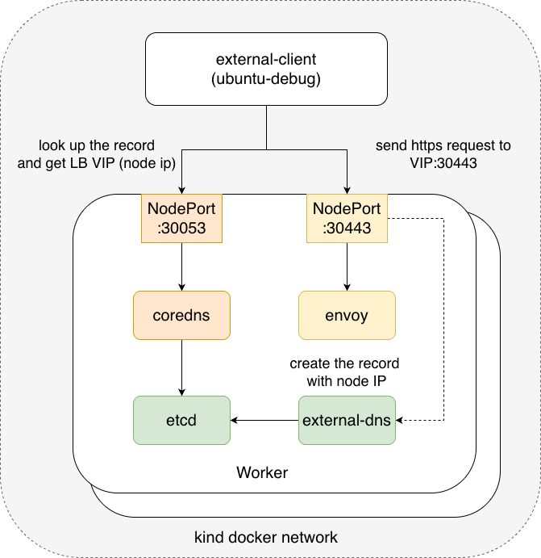

# e2e Test for contour-plus
This directory contains end-to-end (e2e) tests for contour-plus.

## Running the e2e test
Run the following commands to download the required tools, create the test environment, and execute the tests:
```console
$ make setup
$ make e2e
```

## Test environment
The e2e tests run against a Kind cluster created specifically for this suite.
The cluster includes the following components:
- contour
- cert-manager
- external-dns
- CoreDNS
- etcd (used as the backend for CoreDNS)

For local testability, external-dns is configured to write DNS records into CoreDNS.

The relationship between the components are depicted below.



Once the cluster is ready, the e2e tests validate the primary functionality of contour-plus: providing TLS for endpoints defined via HTTPProxy.
